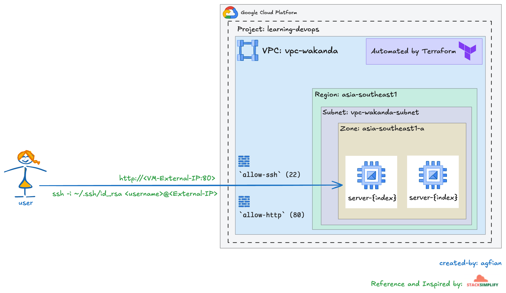
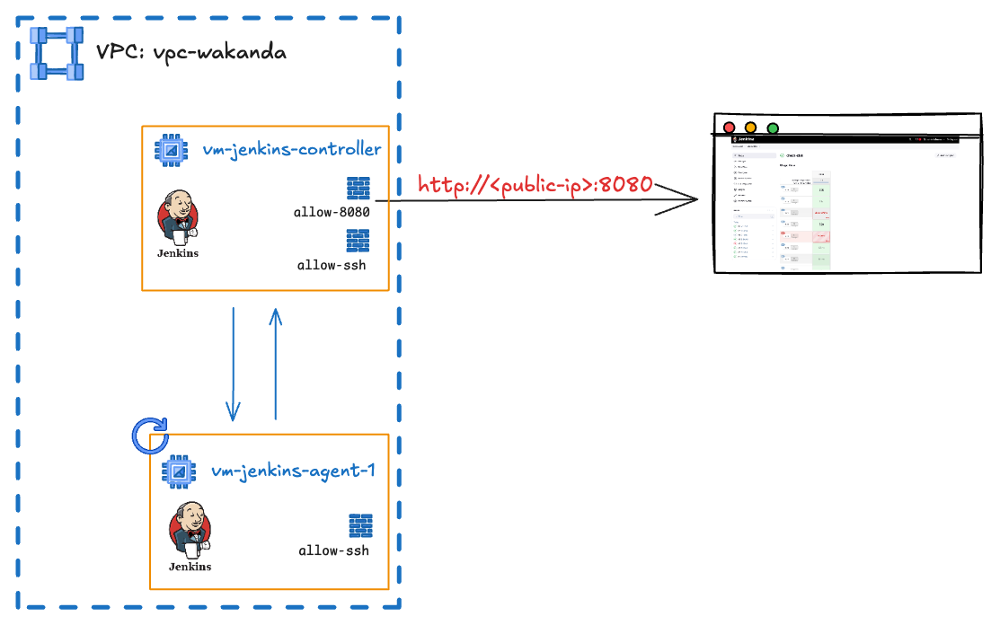

# Hands On Terraform  🚀

## Project 1: Provisioning VM Instances


This project demonstrates how to provision multiple VM instances, configure networking, and set up firewall rules on GCP using Terraform.

## Project 2: Jenkins Provisioning


Provisions Jenkins controller and agent VMs, sets up networking, and installs Jenkins using a startup script.

## Project 3: Self-hosted GitLab
Provisions a VM for self-hosted GitLab using Docker Compose, with custom VPC, firewall, and SSH on port 2222. See `projects/003-self-hosted-gitlab/README.md` for details.

## Project 4: FastAPI App Node
Provisions a VM for running a FastAPI app with Docker and Docker Compose, including custom VPC and firewall. See `projects/004-app-node/README.md` for details.

## Project Structure 📂

```bash
└── 📁 projects/
    ├── 001-provisioning-instance/
    ├── 002-provisioning-jenkins/
    ├── 003-self-hosted-gitlab/
    ├── 004-app-node/
    └── 005-provisioning-ec2-aws/
```

## Reference:
- Install Jenkins: https://phoenixnap.com/kb/install-jenkins-ubuntu
- Install GitLab: https://about.gitlab.com/install/#ubuntu